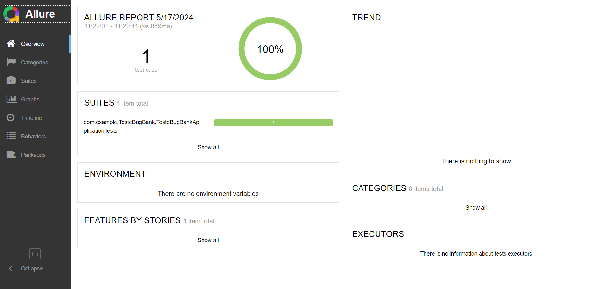

# TesteBugBank

## 1-Pré-requisitos 

java 17

Gradle 

Git 

Navegador Chrome

Drivers Chrome

Dependencias: 

## 2-Clonar o Repositório

git clone [https://github.com/Lucca08/TesteBugBank.git]

cd TesteBugBank

## 3-Dependencias

org.springframework.boot:spring-boot-starter-data-jpa
org.springframework.boot:spring-boot-starter-security
org.springframework.boot:spring-boot-starter-web
org.projectlombok:lombok
org.springframework.boot:spring-boot-devtools
org.postgresql:postgresql
org.springframework.boot:spring-boot-starter-test
org.springframework.restdocs:spring-restdocs-mockmvc
org.springframework.security:spring-security-test
org.seleniumhq.selenium:selenium-java
org.springframework.boot:spring-boot-dependencies
org.springframework.boot:spring-boot-starter
org.springframework.boot:spring-boot-starter-thymeleaf
org.springframework.boot:spring-boot-starter-validation
io.qameta.allure:allure-junit5
io.qameta.allure:allure-selenide
org.springframework.boot:spring-boot-starter-aop
org.aspectj:aspectjweaver

## 4-Relatorio de Teste

